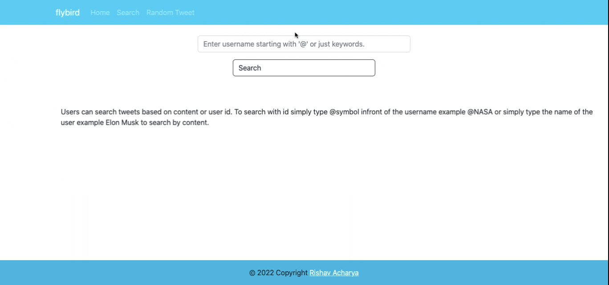

Twitter Showcase App

This is a full stack app, that has a back-end and a front-end. The back-end is written in node.js and express and th front-end is written with javascript and react. The app fetches data from the twitter api and delivers the relevant information to the front-end. Users can search tweets based on the username '@' symbol in front of their username and users can simply search tweets based on keywords. The application also has additional functionality where users can click on my five favorite twitter users and get a random tweet from each user.
 

